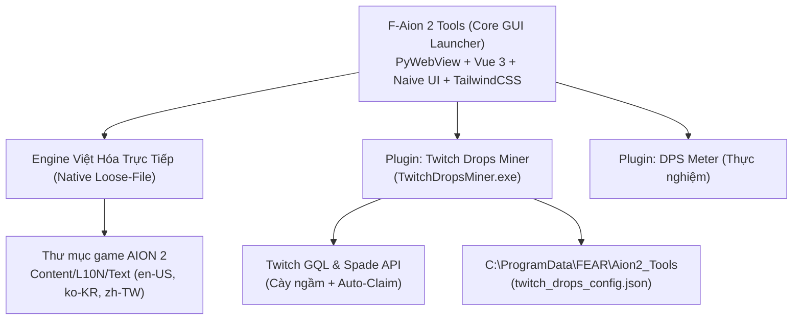

# 🚀 AION 2 TOOLS & VIỆT HÓA - TIẾN ĐỘ & LỘ TRÌNH PHÁT TRIỂN (PROJECT ROADMAP)
*Dự án phát triển bởi: **Team FEΔR / SrymC (BER)***  
*Cập nhật lần cuối: Tháng 10/2026 (Phiên bản hiện tại: **v1.1.1**)*

---

## 📌 1. TỔNG QUAN HỆ THỐNG & KIẾN TRÚC DỰ ÁN

Hệ sinh thái **F-Aion 2 Tools** được thiết kế theo kiến trúc Module hóa (Decoupled Architecture), tách biệt giữa Core Launcher, Engine Việt hóa và các Plugin chạy độc lập:



### Các Thành Phần Trọng Yếu:
1. **Core Launcher (`F-Aion 2 Tools.exe`):**
   - Giao diện Modern Cyberpunk / Dark Mode (Vue 3, Naive UI, TailwindCSS, PyWebView).
   - Kiểm tra đường dẫn cài đặt AION 2 qua Windows Registry hoặc chọn tay.
   - Cài đặt & gỡ bỏ Việt hóa bằng 1-Click (tương thích 100% Purple Launcher, không cần GearUP Booster).
   - Quản lý và kích hoạt các plugin mở rộng.
2. **Standalone Installer (`AION2_VietHoa_Standalone_Tool.zip`):**
   - Dành cho người dùng muốn cài đặt nhanh qua script PowerShell (`install.ps1`, `uninstall.ps1`) kèm thư mục dữ liệu `Data/`.
3. **Plugin Twitch Drops Miner (`TwitchDropsMiner.exe`):**
   - Tiến trình chạy ngầm độc lập được ký bảo mật với Launcher chính (`--fear-launcher <SECURITY_KEY_HASH>`).
   - Cửa sổ Native HUD: Có chế độ thu nhỏ Mini HUD Widget nổi trên màn hình khi chơi game, ghim On-Top.
   - Cơ chế cày ngầm chuẩn DevilXD: GQL `sendSpadeEvents` (GZIP_B64 + Twilight repository) kết hợp Spade POST endpoint fallback.
   - Tự động tìm kiếm stream AION 2 có lượng người xem cao nhất, theo dõi từng phút và auto-claim quà khi đạt 100%.

---

## 🟢 2. TIẾN ĐỘ ĐÃ HOÀN THÀNH (MILESTONES COMPLETED)

### ✅ Giai Đoạn 1: Engine Việt Hóa & Công Cụ Độc Lập
- [x] Giải mã cấu trúc `L10NString.dat` của engine Unreal Engine trong AION 2.
- [x] Hoàn thiện bộ từ điển dịch thuật tiếng Việt chuẩn hóa:
  - **Giữ nguyên 100% tiếng Anh cho:** Tên kỹ năng, nội tại (Passive), Stigma, tên chế độ chơi (*Season, Transcendence, Nightmare, Ascension Trial, Abyss, Arena, Arcana*).
  - **Dịch chuẩn xác:** Toàn bộ Tooltip mô tả hiệu ứng, cơ chế, chỉ số trang bị và nhiệm vụ.
- [x] Tạo cơ chế ghi đè Native Loose-File Override (không can thiệp file gốc `.pak`, không bị Purple Launcher quét sửa file).
- [x] Tạo bộ cài đặt Standalone đóng gói ZIP hoàn chỉnh.

### ✅ Giai Đoạn 2: Plugin Twitch Drops Miner & Giao Diện HUD
- [x] Xây dựng giao diện Drops HUD phong cách Neon Dark / Game Aesthetic.
- [x] Đăng nhập nhanh tài khoản Twitch qua Webview tự động trích xuất cookie `auth-token`.
- [x] Hỗ trợ đăng nhập thiết bị qua mã OAuth Device Code (chuẩn DevilXD SmartTV).
- [x] Tải danh sách chiến dịch Drops đang diễn ra và tự động hiển thị ảnh phần thưởng trực tiếp từ Twitch CDN.
- [x] Chế độ Mini HUD Widget thu gọn góc màn hình (360x95px) giúp game thủ tiện theo dõi khi đang chơi game.

### ✅ Giai Đoạn 3: Hotfix v1.1.1 - Khắc Phục Lỗi Cày Ngầm & Windows Encoding
- [x] **Sửa lỗi Crash Worker Thread trên Windows (`cp1252`):** Thay thế việc print chuỗi emoji/ký tự tiếng Việt bằng hàm `_safe_log` an toàn, cấu hình `sys.stdout.reconfigure(encoding="utf-8")` và ghi trực tiếp binary buffer, bọc khối bảo vệ `try...except` toàn bộ chu kỳ cày ngầm.
- [x] **Sửa lỗi Watch Tick không ăn phút:** Khắc phục xung đột `Client-Id` giữa token đăng nhập web và OAuth, triển khai cơ chế kép GQL `sendSpadeEvents` (GZIP_B64) + Spade POST. Đã kiểm tra thực chiến thành công trên server Twitch.
- [x] **Hiển thị Real-time Live Progress:** Bổ sung dòng thông báo trạng thái trực tiếp ngay dưới streamer: `⚡ Đang cày: [Tên phần thưởng] (X/Ym - Z%) • +N MINS`.
- [x] **Chống khóa file cài đặt Plugin:** Nâng cấp [app.py](file:///h:/AION2_Code/trans/app.py) tự động đóng tiến trình cũ trước khi cập nhật file vào `C:\ProgramData\FEAR\Aion2_Tools`.
- [x] **Tự động hóa Release:** Hoàn thiện script build và tự động upload song song lên 2 repository: `srymcfear/DEV-Aion2Viet` và `srymcfear/Aion2Viet`.

---

## 🟡 3. LỘ TRÌNH TIẾP THEO (NEXT ROADMAP & BACKLOG)

Dưới đây là các đầu việc ưu tiên cần thực hiện trong các phiên bản kế tiếp:

### 🎯 Ưu Tiên Cao (Phase 1: Polish & User Experience)
- [ ] **Bộ Chuyển Đổi Kênh Streamer Bằng Tay (Manual Target Selector):**
  - Hiện tại tool tự động chọn streamer có số viewer cao nhất trong danh mục AION 2.
  - *Nâng cấp:* Thêm dropdown danh sách top 5 streamer AION 2 đang live để người dùng tự chọn kênh muốn cày hộ nếu muốn.
- [ ] **Multi-Account Switcher (Chuyển đổi nhiều nick Twitch):**
  - Lưu trữ profile nhiều tài khoản Twitch trong cấu hình và cho phép switch nhanh giữa các nick mà không cần login lại từ đầu.
- [ ] **Thông Báo Windows Khi Nhận Quà (Native Desktop Notification):**
  - Hiển thị Toast Notification của Windows khi có một mốc quà Drops hoàn thành hoặc được tự động nhận (Auto-Claim).

### 🎯 Ưu Tiên Trung Bình (Phase 2: Live Patching & Automation)
- [ ] **OTA Dictionary Patcher (Cập nhật Việt hóa qua mạng):**
  - Khi game có bản update nhỏ hoặc bổ sung bản dịch mới, tool tự tải file delta từ GitHub Release về nạp thẳng vào thư mục game mà người dùng không cần tải lại file zip hay file exe mới.
- [ ] **Tự Động Cập Nhật Bản Mới (In-App Auto Updater):**
  - Launcher tự so khớp phiên bản qua `fearAion2Tran-ver` trên GitHub Release và hiển thị nút "Cập nhật ngay" để tải và thay thế file tự động.

### 🎯 Tính Năng Nâng Cao (Phase 3: Extended Tools)
- [ ] **Tối Ưu Plugin DPS Meter:**
  - Hoàn thiện module đo DPS / sát thương thời gian thực cho AION 2 (nghiên cứu phương án đọc combat log an toàn không vi phạm Anti-Cheat).

---

## 🛠️ 4. HƯỚNG DẪN BUILD & VẬN HÀNH CHO DEV (DEV PLAYBOOK)

Mỗi khi cần chỉnh sửa, kiểm tra và phát hành bản cập nhật mới, thực hiện đúng các bước sau:

### 1. Kiểm tra & Chạy thử nghiệm môi trường Dev:
```bash
# Chạy thử Launcher chính
python app.py

# Chạy thử Plugin Twitch Drops độc lập
python plugins/twitch_drops/twitch_drops_app.py --fear-launcher 4eb733f752b4f4e3f25fcde3424c38f92435721355b8c981e1e773164126da90
```

### 2. Đóng gói Binary bằng PyInstaller:
```bash
# Bước 2.1: Build Plugin TwitchDropsMiner.exe
cd plugins/twitch_drops
pyinstaller TwitchDropsMiner.spec --noconfirm --clean
cd ../..

# Bước 2.2: Đồng bộ TwitchDropsMiner.exe vừa build vào các thư mục liên quan
powershell -Command "Copy-Item 'plugins/twitch_drops/dist/TwitchDropsMiner.exe' 'plugins/twitch_drops/TwitchDropsMiner.exe' -Force; Copy-Item 'plugins/twitch_drops/dist/TwitchDropsMiner.exe' 'dist/plugins/twitch_drops/TwitchDropsMiner.exe' -Force; Copy-Item 'plugins/twitch_drops/dist/TwitchDropsMiner.exe' 'C:\ProgramData\FEAR\Aion2_Tools\plugins\twitch_drops\TwitchDropsMiner.exe' -Force"

# Bước 2.3: Build Launcher chính F-Aion 2 Tools.exe
pyinstaller "F-Aion_2_Tools.spec" --noconfirm --clean

# Bước 2.4: Đóng gói Standalone ZIP
node package_standalone.js
```

### 3. Commit Code & Release GitHub:
```bash
# Git Commit (Tuân thủ Git standard)
git add -A
git commit -m "feat/fix(...): <mô tả ngắn gọn>"
git push origin main
git push public main

# Tự động xuất bản Release lên cả 2 kho (srymcfear/DEV-Aion2Viet & srymcfear/Aion2Viet)
python scratch/publish_to_github.py
```

### 4. Vị Trí Dữ Liệu & Khắc Phục Nhanh Sự Cố:
- **Thư mục cấu hình dữ liệu:** `C:\ProgramData\FEAR\Aion2_Tools\`
- **File config Twitch:** `C:\ProgramData\FEAR\Aion2_Tools\twitch_drops_config.json`
- **File exe plugin đã cài:** `C:\ProgramData\FEAR\Aion2_Tools\plugins\twitch_drops\TwitchDropsMiner.exe`
- **Lưu ý khi thay thế file:** Luôn tắt sạch tiến trình trong Task Manager (`taskkill /F /IM TwitchDropsMiner.exe`) trước khi copy đè file binary.
